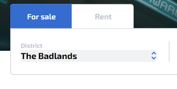
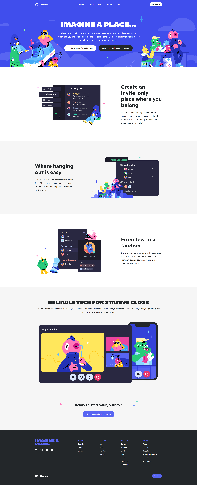

# DISCORD - Procesverslag - FED211
Welkom bij mijn Front-end Development opdracht! In dit
verslag laat ik gedurende het eerste blok van leerjaar 2021/2022 zien wat ik
allemaal heb gedaan om uiteindelijk tot een toffe website te komen.

## Over mij

Lees hier meer over mij

### Auteur:
Maijla Ikiz [(portfolio)](https://oege.ie.hva.nl/~ikizm001/noyamirai.io/ "Maijla's Portfolio")

#### Mijn startniveau:
Voor dit vak zal mijn startniveau de Zwarte Piste zijn. Ik ben momenteel al
bijna drie jaar werkzaam bij een bedrijf als designer en front-end developer.
Voordat ik bij CMD kwam heb ik de studie Software Engineering gevolgd, ik weet
dus het een en ander over programmeren!

Vorig jaar heb ik mezelf voor het vak programmeren uitgedaagd om een
[hacking simulator](https://oege.ie.hva.nl/~ikizm001/kiroshisystem.io/ "Hacking Simulator 1.0")
te maken in HTML/CSS/JS. Door mezelf uit te dagen heb ik iets kunnen
maken waar ik trots op ben, maar ook iets waar leraren en medestudenten onder
de indruk van waren (het project werd genomineerd voor een [Golden Dot Award](https://www.cmd-amsterdam.nl/portfolio/hacking-simulator-1-0/ "GDA Nominatie"))

Ik had enorm veel plezier in het bouwen van de website en het leren van nieuwe
technieken, daarom ben ik van plan om voor dit vak met dezelfde houding te gaan
starten! :D

#### Projectfocus:
De focus zal een combinatie worden van responsiviteit en extra aandacht voor
de Surface laag. Voor de Surface laag waren een aantal onderwerpen waaruit ik
kan kiezen. Uit deze onderwerpen heb ik er vijf gekozen:

- Toegankelijkheid
- Advanced positioning
- Custom properties
- Scroll animatie
- DOM manipulatie

## Over het project

Lees hier de debriefing van Night City Living

### Opdrachtbeschrijving:
Voor dit vak was ik als eerst begonnen met het maken van mijn eigen bedachte
website, namelijk: Night City Living! Night City Living is een site waarmee
gebruikers als het ware "beschikbare" huur- of koopwoningen uit de game
Cyberpunk 2077 kunnen bekijken (het is niet mogelijk om woningen te kopen in de
  game zelf, maar dit is iets wat ik zelf zou willen, vandaar dit idee!).

Gedurende mijn propedeuse jaar heb ik twee andere opdrachten/projecten verzonnen
die, net zoals dit project, geïnspireerd zijn door een spel genaamd Cyberpunk 2077:

- [Hacking Simulator](https://oege.ie.hva.nl/~ikizm001/kiroshisystem.io/ "Hacking Simulator 1.0")
- [Night City News](https://oege.ie.hva.nl/~ikizm001/nightcitynews.nl/")

Het leek me daarom leuk om voor FED ook een cyberpunk gerelateerd project te doen.
Ik was vroeg begonnen met het project, omdat ik wist dat het veel was wat ik voor
elkaar wou krijgen. Tijdens de laatste week raakte mijn motivatie om de
functionaliteiten te maken helaas op. Mezelf kennende wist ik dat ik hierdoor geen
mooi resultaat zou kunnen realiseren. Ik vroeg daarom aan de docent (Robert Spier)
of het oke was dat ik Night City Living laat liggen, en verder ga met het namaken
(zoals eigenlijk ook moest van de opdracht) van een andere website, namelijk Discord.
Robert gaf hiervoor akkoord. De Discord website heb ik binnen twee dagen volledig
responsive kunnen namaken.

#### Design - Night City Living (Landing/Home):
Zoals te zien in de onderstaande afbeelding was het Night City Living ontwerp
gemaakt voor desktop. De reden waarom ik dat voor nu heb gedaan is, omdat dit
project een eigen voorstel was. Voordat ik de mobiele versie ging ontwerpen wou
ik natuurlijk eerst weten of dit voorstel werd geaccepteerd door de docent.
Uiteindelijk was mijn voorstel akkoord en heb ik de mobiele versie een beetje
lopen freestylen tijdens het programmeren zelf.

#### Design - Night City Living (Listings):

#### Design - Discord (Home):

#### Design - Discord (Download):

## Breakdownschets (week 1)

Hieronder de breakdownschetsen van de twee websites

### Night City Living:

### Discord:

## Voortgang 1 (week 2)

Hieronder een samenvatting van het eerste voortgangsgesprek

### Stand van zaken
Ik was redelijk goed voorbereid voor het eerste voortgangsgesprek. Omdat ik al
wat meer ervaring heb met front-end development was ik al snel klaar met de
eerste pagina van mijn website.

### Verslag van meeting
Tijdens het voortgangsgesprek kreeg ik feedback van twee studentassistenten.
Beide studenten waren onder de indruk van wat ik al had kunnen maken in zo'n
korte tijd. Op een aantal plekken had ik classes gebruikt, hier werd natuurlijk
naar gevraagd en na toelichting begrepen ze waarom ik classes gebruikte.

Ook heb ik voor het groeperen van content een div element gebruikt. Hier gaven
ze aan dat het opzich niet fout is wat ik doe, maar het kan waarschijnlijk ook
zonder een div. Als laatste vertelde ze dat ik mijn breakpoint script nog even
goed moet bespreken met Robert, maar deze zal ik hoogst waarschijnlijk sowieso
al verwijderen i.v.m. een bug.

Samengevat:
- Let op met (teveel) classes
- Kijk of het gebruik van een div noodzakelijk is
- Breakpoint script bespreken

## Voortgang 2 (week 3)

Lees hieronder een samenvatting van het tweede voortgangsgesprek

### Stand van zaken
Momenteel gaat het erg goed! Ik heb deze week (20 september) veel gewerkt aan de
site. De tweede pagina is qua HTML zo goed als klaar. Er zijn hier en daar een
aantal divs en andere elementen waar ik nog even goed naar moet kijken, maar
dit is eenvoudig aan te passen. Ook is, naar mijn mening, de stylesheet een
beetje een rommeltje... Hier zal ik deze week nog even aan werken zodat ik
volgende week weer verder kan met de laatste aanpassingen en vervolgens het JS
script voor de resultatenpagina.

### Agenda voor meeting
Wat ik voornamelijk wil weten is of de HTML structuur voor mijn resultatenpagina
semantisch correct is. Wellicht dat er andere oplossingen zijn dat ik over het
hoofd heb gezien. Ik heb de reslultatenpagina namelijk binnen 1 dag gemaakt :p.

### Verslag van meeting
Voor dit voortgangsgesprek kreeg ik feedback van de docent. Robert had niet veel
te zeggen over mijn website. Ik vroeg of hij naar mijn resultatenpagina zou
willen kijken, omdat die pas net gemaakt is. De pagina was over het algemeen goed
opgesteld, alleen zei Robert dat ik mijn custom radio buttons anders kan doen
(alles zit in een label). Ook moet ik voor mijn hamburger menu icon gewoon een
button element gebruiken als container i.p.v. een div element.

Samengevat:
- Custom Radio buttons met input element apart i.p.v. in label
- Button hamburger menu i.p.v. div
- Button toggle i.p.v. div

## Toegankelijkheidstest (week 4)

Lees hieronder mijn bevindingen na de toegankelijkheidstest (Night City Living)

### Bevindingen
- Contrast is te laag voor hover en focus states
- Niet alle afbeeldingen hadden een alt tag

#### Slecht contrast
Tijdens het testen had ik al snel door dat mijn contrast voor de hover en focus
states veel te laag was. Gebruikers met een visuele beperking zullen hierdoor
enorm veel moeite hebben om deze states te zien. Dit probleem kan eenvoudig worden
opgelost door simpelweg gewoon de kleur aan te passen zodat het een hoger
contrast heeft (checken met behulp van de contrast checker in inspector).

#### Niet overal alt tags
Tijdens het testen met een screenreader (op MacOS) kwamen Sasja en ik erachter
dat de alt tags ook voorgelezen werden, waardoor afbeeldingen soms genegeerd
werden. Ik was me er al van bewust dat ik bij een aantal afbeeldingen geen alt tag
had ingevuld. Dit probleem is dus ook eenvoudig op te lossen door gewoon de alt
tags in te vullen met een duidelijke beschrijving.

## Voortgang 3 (week 4)

Lees hieronder een samenvatting van het laatste voortgangsgesprek

### Stand van zaken
Zoals eerder aangegeven ben ik in de laatste week veranderd van website. De reden
hiervoor is omdat ik de Night City Living website niet meer zag zitten. Alles was
opzich gewoon klaar, het enige wat gedaan moest worden was filters toevoegen en
dit werkend krijgen. Na overleg met Robert heb ik Night City Living achter me
gelaten en ben ik begonnen met het namaken van de Discord website. Voor het
laatste voortgangsgesprek was ik begonnen met het maken van de homepagina. De basis
stond er, alleen liep ik erg vast met het responsive maken van de header
(zie discord website).

### Agenda voor meeting
Wat ik graag wou weten was of mijn HTML structuur goed was en of de
studentassistent wellicht wist waarom mijn header niet dezelfde hoogte had als de
header van Discord, terwijl de styling precies hetzelfde was!

### Verslag van meeting
Voor het voortgangsgesprek had ik nog wat laatste wijzigingen gepushed, waardoor
mijn site op mobiel niet meer helemaal correct was. De studentassistent bekeek
daarom kort even de HTML en had hier niet echt iets op aan te merken. Ik vroeg
hem daarom specifiek naar mijn probleem met de header. Daan bekeek de header ook
en vergeleek dit vervolgens met mijn header. Helaas wist Daan ook niet waarom de
hoogte niet klopte.

- Goed de paddings controleren bij de header van de Discord website

## Eindgesprek (week 5)

Bekijk hieronder het eindresultaat

### Stand van zaken
Ondanks dat ik last-minute ben veranderd van website, ben ik best tevreden met
het eindresultaat. Binnen twee dagen heb ik twee pagina's van Discord volledig
responsive kunnen nabouwen. Discord maakte gebruik van CSS Grids, dus het was
voor mij even wennen, maar ik heb hierdoor wel veel geleerd.

### Screenshot(s)

## Bronnenlijst

Lees hieronder een overzicht van alle gebruikte bronnen

1. Cyberpunk edges afbeeldingen - [Night City Website](https://www.nightcity.love)
2. Custom Radio Buttons - [W3Schools](https://www.w3schools.com/howto/tryit.asp?filename=tryhow_css_custom_radio)
3. Custom dropdown input - [StackOverflow](https://stackoverflow.com/questions/14218307/select-arrow-style-change)
4. Hamburger menu animatie - [CodePen](https://codepen.io/designcouch/pen/Atyop)
5. CSS reset - [meyerweb](http://meyerweb.com/eric/tools/css/reset/)
6. Illustraties en animatie transities - [Discord](https://discord.com)
7. Scroll to top - [StackOverflow](https://stackoverflow.com/questions/3664381/force-page-scroll-position-to-top-at-page-refresh-in-html)
8. Reveal on scroll animatie - [Jemima Abu](https://webdesign.tutsplus.com/tutorials/animate-on-scroll-with-javascript--cms-36671)
9. Check which OS is being used - [StackOverflow](https://stackoverflow.com/questions/9514179/how-to-find-the-operating-system-details-using-javascript)

